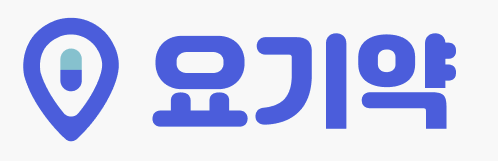
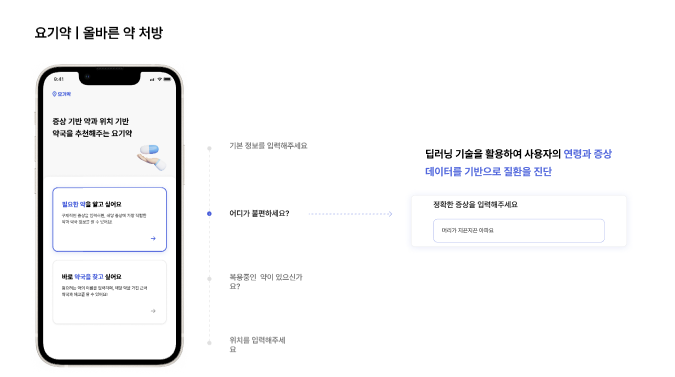
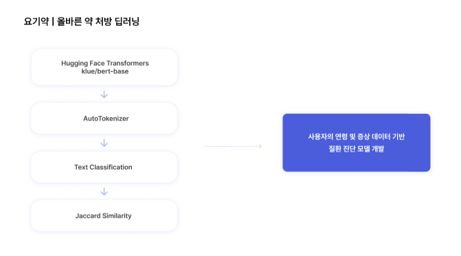

# metaphor 해커톤 team1 

## 서비스 명

## 서비스 소개
AI가 증상을 분석하여 질환을 예측하고, 적절한 약 처방과 함께 근처 약국의 위치 정보를 제공하는 통합 서비스

## 핵심 기능
- 사용자의 데이터 분석과 딥러닝을 통한 질환 예측 및 약 추천
- 사용자 주변 약국의 위치 정보 제공

## 팀원소개
| 이름   | 포지션        |
|--------|--------------|
| 박상현 | PM            | 
| 정도윤 | PM            |
| 남효린 | 메디컬        |
| 이수민 | 디자인        |
| 김시은 | 프론트        |
| 최하은 | 프론트        | 
| 박민서 | 백엔드        | 
| 장경준 | 백엔드        |
| 홍수인 | 딥러닝        |
| 오서영 | 데이터분석    |
| 정연우 | 데이터분석    |
